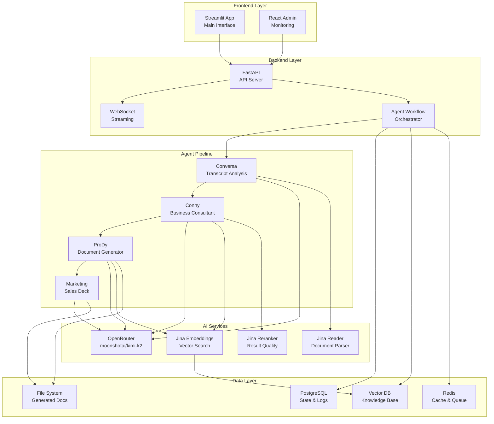
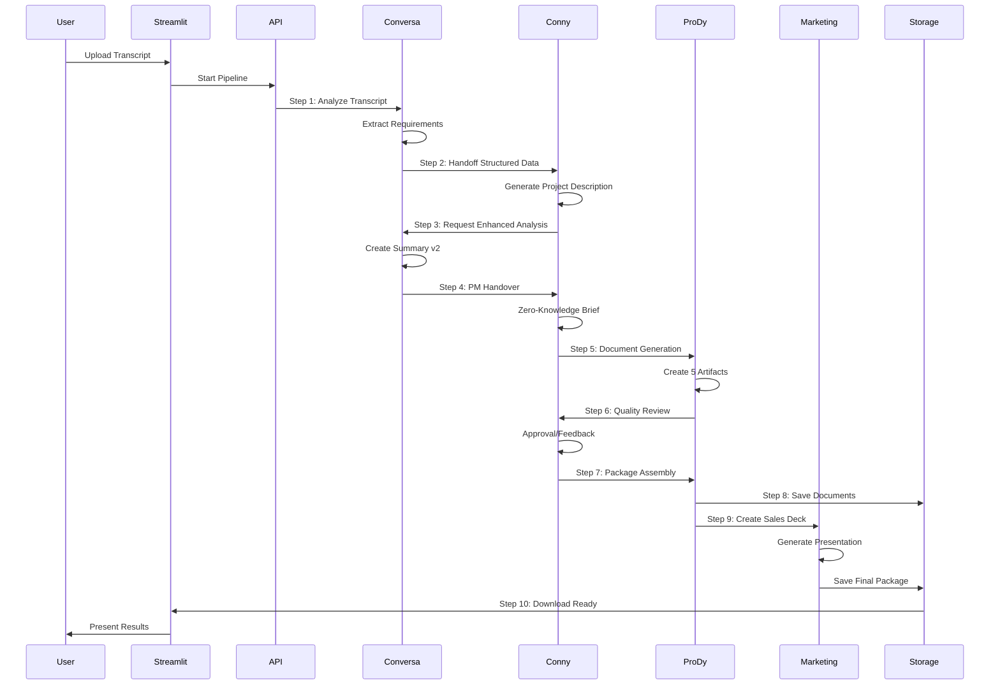
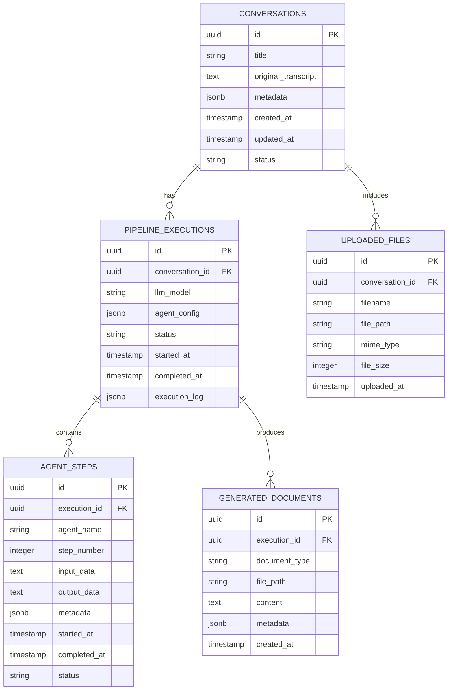
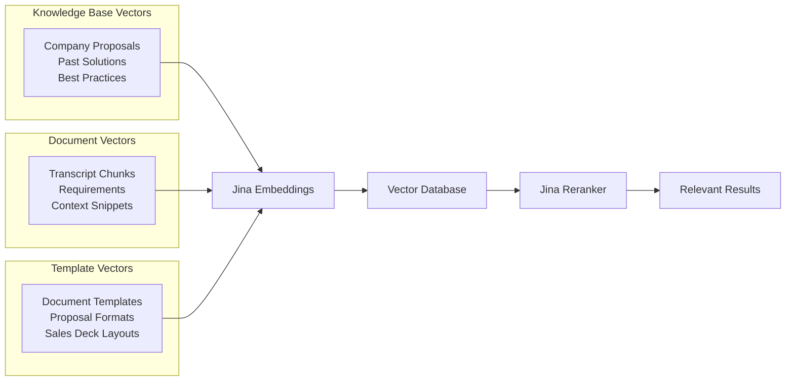
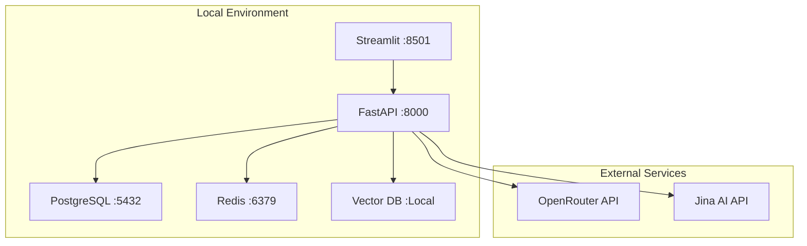
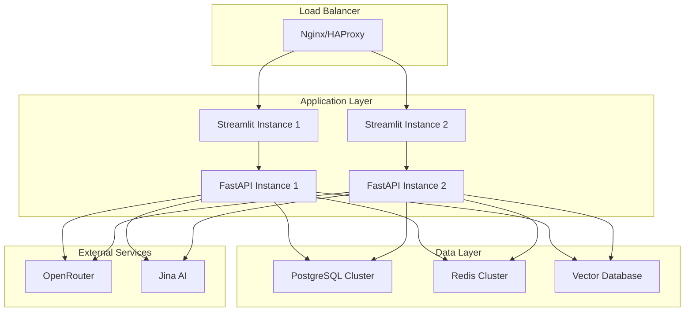

# Technical Architecture & Requirements Analysis

## 🎯 Business Context
**Goal**: Transform customer discovery call transcripts into comprehensive proposal packages, reducing proposal cycle-time by 30% through intelligent automation.

## 📋 Technical Requirements Analysis

### Core Technology Decisions & Rationale

#### **AI/LLM Stack**
- **Primary LLM**: `moonshotai/kimi-k2` via OpenRouter
  - **Why**: Cost-effective, high-quality model with good reasoning capabilities
  - **Usage**: All agent reasoning, document generation, conversation analysis
  
- **Embeddings**: `jina-embeddings-v2-base-en` via Jina AI
  - **Why**: High-performance embeddings optimized for semantic search
  - **Usage**: RAG system, knowledge base vectorization, transcript chunking
  
- **Reranker**: `jina-reranker-v1-base-en` via Jina AI
  - **Why**: Improves retrieval quality for complex business contexts
  - **Usage**: Enhanced RAG search, solution matching, proposal relevance scoring

- **Additional Jina AI Services**:
  - **Reader**: Document parsing (PDF, DOCX, TXT)
  - **Segmenter**: Intelligent text chunking for transcripts
  - **Classifier**: Intent detection and document categorization

#### **Backend Architecture**
- **Framework**: FastAPI with async/await
  - **Why**: High-performance async support, automatic OpenAPI docs, excellent for AI workloads
  - **Usage**: API endpoints, WebSocket streaming, agent orchestration
  
- **Agent Framework**: LlamaIndex AgentWorkflow
  - **Why**: Mature multi-agent patterns, streaming support, tool integration
  - **Usage**: 10-step pipeline orchestration, state management, handoffs

- **Database**: PostgreSQL with JSONB
  - **Why**: Strong consistency, JSON support for flexible schemas, robust for production
  - **Usage**: Conversation state, agent execution logs, document metadata
  
- **Vector Database**: Embedded in LlamaIndex (Chroma/FAISS)
  - **Why**: Simplified deployment, good performance for moderate scale
  - **Usage**: Company knowledge base, proposal templates, solution matching

- **Cache/Queue**: Redis
  - **Why**: Fast in-memory storage for sessions and async task queues
  - **Usage**: WebSocket connections, pipeline state, background processing

#### **Frontend Strategy**
- **Main App**: Streamlit
  - **Why**: Rapid development for ML/AI interfaces, perfect for transcript processing workflows
  - **Usage**: File upload, pipeline monitoring, document preview/download
  
- **Admin Interface**: Existing React app
  - **Why**: Already built and production-ready
  - **Usage**: System monitoring, proposal review, analytics dashboard

## 🏗️ System Architecture

### High-Level Architecture Diagram



### 10-Step Agent Pipeline Flow



## 📊 Data Architecture

### Database Schema Design



### Vector Database Schema



## 🔧 Development Tools & Libraries

### Required Dependencies

```python
# Core Framework
fastapi[all]>=0.104.0
uvicorn[standard]>=0.24.0
llama-index>=0.10.0
streamlit>=1.28.0

# AI & LLM
llama-index-llms-openrouter>=0.1.0
llama-index-embeddings-jinaai>=0.1.0
openai>=1.3.0  # For OpenRouter compatibility

# Database & Storage
asyncpg>=0.29.0
sqlalchemy[asyncio]>=2.0.0
redis[hiredis]>=5.0.0
alembic>=1.12.0

# Document Processing
python-multipart>=0.0.6
python-docx>=0.8.11
PyPDF2>=3.0.1
markdown>=3.5.0

# Utilities
python-dotenv>=1.0.0
pydantic>=2.4.0
structlog>=23.2.0
httpx>=0.25.0
```

### Development & Testing Tools

```python
# Testing
pytest>=7.4.0
pytest-asyncio>=0.21.0
pytest-mock>=3.12.0
httpx>=0.25.0  # For API testing

# Development
black>=23.9.0
ruff>=0.1.0
mypy>=1.6.0
pre-commit>=3.4.0

# Monitoring
prometheus-client>=0.18.0
structlog>=23.2.0
```

## 🚀 Deployment Architecture

### Local Development



### Production Deployment (Future)



## 📝 Architecture Decision Records (ADRs)

### ADR-001: LLM Model Selection
- **Decision**: Use `moonshotai/kimi-k2` as primary LLM
- **Rationale**: Cost-effective, good reasoning, multilingual support
- **Alternatives**: GPT-4o (more expensive), Claude-3.5 (rate limits)
- **Impact**: Reduced operational costs while maintaining quality

### ADR-002: Embedding Strategy
- **Decision**: Jina AI embeddings + reranker combination  
- **Rationale**: High performance, specialized for search, good pricing
- **Alternatives**: OpenAI embeddings (more expensive), local models (lower quality)
- **Impact**: Better RAG performance for business document matching

### ADR-003: Frontend Architecture
- **Decision**: Streamlit for main app, React for admin
- **Rationale**: Streamlit optimized for ML workflows, React already built
- **Alternatives**: All React (slower development), all Streamlit (limited admin features)
- **Impact**: Faster development while preserving admin capabilities

### ADR-004: Database Choice
- **Decision**: PostgreSQL with JSONB for flexibility
- **Rationale**: Strong consistency, JSON flexibility, proven scalability
- **Alternatives**: MongoDB (consistency concerns), SQLite (scaling limitations)
- **Impact**: Production-ready foundation with flexible schema evolution

## 🔍 Next Development Steps

### Epic 1: Backend Foundation
1. **FastAPI Setup**: Basic server with health checks
2. **Database Setup**: PostgreSQL schema and migrations
3. **OpenRouter Integration**: LLM connectivity testing
4. **Jina AI Integration**: Embeddings and reranker setup

### Epic 2: Agent Pipeline Core
1. **LlamaIndex Workflow**: Basic 10-step pipeline structure
2. **Agent Definitions**: Conversa, Conny, ProDy, Marketing agents
3. **State Management**: Conversation and execution tracking
4. **WebSocket Streaming**: Real-time progress updates

### Epic 3: Document Processing
1. **File Upload**: Transcript parsing with Jina Reader
2. **Document Generation**: Markdown templates and Mermaid diagrams
3. **RAG System**: Knowledge base integration
4. **Output Packaging**: ZIP file generation for proposals

This architecture provides a solid foundation for iterative development while maintaining production readiness and scalability.