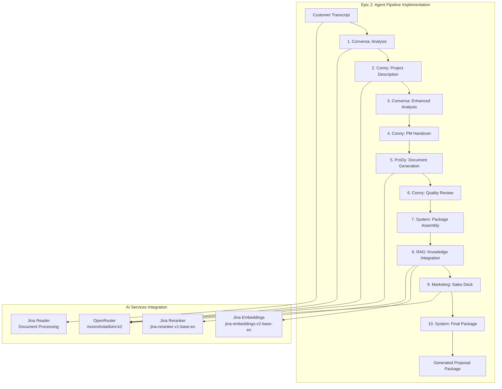

# Epic 2 Plan: LlamaIndex Agent Pipeline Integration

**Epic Goal**: Implement the core 10-step agent workflow using LlamaIndex AgentWorkflow with OpenRouter and Jina AI integration.

## 🎯 Business Objective
Transform customer discovery call transcripts through a specialized agent pipeline to generate:
- Structured problem analysis
- Solution process documentation  
- Visual process diagrams (Mermaid)
- Investment proposals with roadmaps
- Customer-facing sales decks

**Target**: Enable 30% reduction in proposal cycle-time through intelligent automation.

## 🏗️ Technical Architecture for Epic 2

### Agent Pipeline Flow


## 🧩 Epic 2 Components

### Component 1: LLM Integration Layer
**Files**: `ai/src/llm_integration.py`
- OpenRouter client setup with `moonshotai/kimi-k2`
- Response streaming and token management
- Error handling and retry logic
- Model configuration and parameters

### Component 2: Jina AI Integration Layer  
**Files**: `ai/src/jina_integration.py`
- Embeddings service for knowledge base
- Reranker for improved retrieval quality
- Reader service for document processing
- API client with authentication

### Component 3: Agent Definitions
**Files**: `ai/src/agents/`
- `conversa_agent.py`: Transcript analysis specialist
- `conny_agent.py`: Business consultant and solution architect  
- `prody_agent.py`: Product manager and document generator
- `marketing_agent.py`: Sales deck creation specialist

### Component 4: Agent Tools
**Files**: `ai/src/tools/`
- `transcript_tools.py`: Document parsing and analysis
- `rag_tools.py`: Knowledge base search and retrieval
- `document_tools.py`: Markdown and Mermaid generation
- `template_tools.py`: Proposal and deck templates

### Component 5: AgentWorkflow Implementation
**Files**: `ai/src/workflow.py`
- LlamaIndex AgentWorkflow orchestration
- 10-step pipeline state management
- Agent handoff and communication
- Progress streaming via WebSocket

### Component 6: Knowledge Base System
**Files**: `ai/src/knowledge_base.py`
- Vector database setup with embeddings
- Document ingestion pipeline
- RAG search with reranking
- Company knowledge management

## 📋 Implementation Tasks

### Task 1: Core AI Services Setup
```python
# Expected structure:
ai/
├── src/
│   ├── __init__.py
│   ├── llm_integration.py      # OpenRouter integration
│   ├── jina_integration.py     # Jina AI services
│   └── config.py              # AI-specific configuration
├── tests/
│   ├── test_llm_integration.py
│   └── test_jina_integration.py
```

**Deliverables**:
- OpenRouter client with `moonshotai/kimi-k2` configured
- Jina AI services (embeddings, reranker, reader) working
- Unit tests for both integrations
- Configuration management for AI services

### Task 2: Agent Implementation
```python
# Expected structure:
ai/src/agents/
├── __init__.py
├── base_agent.py              # Common agent functionality
├── conversa_agent.py          # Transcript analysis
├── conny_agent.py             # Business consulting  
├── prody_agent.py             # Document generation
└── marketing_agent.py         # Sales deck creation
```

**Deliverables**:
- 4 specialized agents with distinct personalities
- Agent tool integration and handoff capabilities
- Streaming output support for real-time updates
- Agent-specific prompt engineering and configuration

### Task 3: Tool Development
```python
# Expected structure:
ai/src/tools/
├── __init__.py
├── transcript_tools.py        # Document processing
├── rag_tools.py              # Knowledge base search
├── document_tools.py         # Content generation
└── template_tools.py         # Proposal templates
```

**Deliverables**:
- Transcript parsing with Jina Reader integration
- RAG search with embedding and reranking
- Markdown and Mermaid diagram generation
- Template system for consistent output formatting

### Task 4: Workflow Orchestration
```python
# Expected structure:
ai/src/
├── workflow.py               # Main AgentWorkflow implementation
├── pipeline_state.py        # State management
└── streaming.py             # Real-time progress updates
```

**Deliverables**:
- LlamaIndex AgentWorkflow with 10-step pipeline
- State persistence between agent handoffs  
- WebSocket integration for progress streaming
- Error handling and recovery mechanisms

### Task 5: Integration with Backend
```python
# Expected integration points:
be/src/
├── ai_orchestrator.py        # AI pipeline controller
└── pipeline_api.py          # API endpoints for pipeline
```

**Deliverables**:
- FastAPI endpoints to trigger pipeline execution
- Database integration for conversation and execution tracking
- WebSocket streaming of agent progress to frontend
- Error handling and logging integration

## 🧪 Testing Strategy

### Unit Tests
- LLM integration with mocked responses
- Jina AI service integration tests
- Individual agent functionality testing
- Tool execution and output validation

### Integration Tests
- Full pipeline execution with test transcripts
- Agent handoff and state management
- Database persistence of execution results
- WebSocket streaming functionality

### End-to-End Tests
- Complete transcript-to-proposal flow
- Multi-step agent workflow validation
- Generated document quality verification
- Performance benchmarking

## 📊 Success Metrics

### Technical Metrics
- **Pipeline Execution Time**: Target < 5 minutes for complete flow
- **Agent Success Rate**: > 95% successful step completions
- **LLM Response Quality**: Structured output validation
- **RAG Retrieval Accuracy**: Relevant knowledge base matches

### Business Metrics  
- **Document Generation Quality**: Structured, coherent proposals
- **Knowledge Integration**: Relevant historical solution matching
- **Template Consistency**: Professional formatting compliance
- **Stakeholder Handoff**: Clear PM documentation

## 🔧 Dependencies to Install

### Core LlamaIndex
```bash
pip install llama-index>=0.10.68
llama-index-llms-openrouter>=0.3.2
llama-index-embeddings-jinaai>=0.1.2
```

### Additional AI Services
```bash
pip install jina>=3.0.0
chromadb>=0.4.0  # Vector database
beautifulsoup4>=4.12.0  # Document parsing
markdown>=3.5.0  # Document generation
```

### Development Tools
```bash
pip install tiktoken>=0.5.0  # Token counting
tenacity>=8.2.0  # Retry logic
```

## 🚀 Implementation Order

1. **LLM Integration** (OpenRouter + moonshotai/kimi-k2) - Foundation
2. **Jina AI Services** (Embeddings, Reranker, Reader) - Knowledge layer  
3. **Agent Definitions** (Conversa, Conny, ProDy, Marketing) - Business logic
4. **Tool Development** (Transcript, RAG, Document, Template) - Capabilities
5. **Workflow Implementation** (AgentWorkflow orchestration) - Pipeline
6. **Backend Integration** (API endpoints, streaming) - System integration

## 🎯 Epic 2 Completion Criteria

- ✅ OpenRouter LLM integration working with moonshotai/kimi-k2
- ✅ Jina AI services (embeddings, reranker, reader) operational
- ✅ 4 agents implemented with distinct personalities and capabilities
- ✅ Tool ecosystem supporting transcript processing and document generation
- ✅ LlamaIndex AgentWorkflow orchestrating 10-step pipeline
- ✅ Backend API integration with pipeline execution endpoints
- ✅ WebSocket streaming of agent progress to frontend
- ✅ Unit and integration tests covering all components
- ✅ Complete transcript-to-proposal flow working end-to-end
- ✅ Epic 2 completion visualization with Mermaid diagrams

**Target Duration**: 2-3 development sessions
**Business Impact**: Enable automated transcript-to-proposal generation

This plan provides a clear roadmap for implementing the core AI pipeline that will deliver the 30% proposal cycle-time reduction goal.