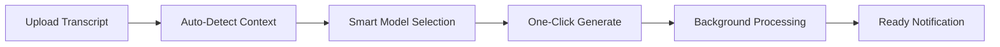
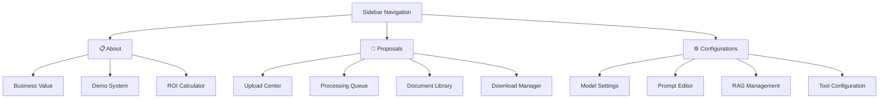

# UI/UX Enhancement Plans - LazyFlow Design Principles

**Vision**: Single-tap, non-technical user experience achieving ≥90% task completion rate  
**Core Principle**: Smart defaults • Automated workflows • Zero manual steps  
**Target User**: Business professionals expecting one-click proposal generation  

---

## 🎯 **Immediate Improvements (Current Sprint)**

### 1. **Mermaid Diagram Visualization** ✅ IMPLEMENTING NOW
- **Problem**: Diagrams showing as code blocks instead of rendered visuals
- **Solution**: Implement proper Mermaid rendering in Streamlit using `streamlit-mermaid` or HTML/CSS
- **Impact**: Visual process flows enhance understanding and professional presentation

### 2. **Sidebar Navigation Restructure** ✅ IMPLEMENTING NOW
- **Current**: 4 tabs (Overview, Input & Config, Prompts & Templates, Progress & Output)
- **New LazyFlow Structure**:
  - **📋 About** - Business value proposition and demo system
  - **🎯 Proposals** - Main workspace for transcript processing and document generation
  - **⚙️ Configurations** - Advanced settings (prompts, tools, RAG management)

### 3. **Enhanced Model Selection** 📋 NEXT PHASE
- **Current**: 4 basic models (GPT-4o, Claude, Llama, GPT-4o-mini)
- **Planned**: User-provided model list with smart categorization
- **UI Pattern**: Grouped selection with performance/cost indicators

---

## 🚀 **Advanced LazyFlow Features (Future Phases)**

### **Multi-Tenant Document Storage System**
- **Company Knowledge Base**: Organization-wide proposals, case studies, methodologies
- **Customer Project Storage**: Client-specific documents and context (like Claude Projects)
- **Smart Routing**: Auto-detect relevant documents based on transcript content
- **UI Pattern**: Tabbed storage with drag-drop organization

### **One-Click Proposal Generation**
- **Smart Defaults**: Auto-select optimal model based on transcript complexity
- **Background Processing**: Queue system for multiple proposal generation
- **Adaptive Learning**: Remember user preferences and successful patterns
- **Progress Transparency**: Real-time updates without requiring user attention

### **Intelligent Configuration Management**
- **Context-Aware Prompts**: Auto-suggest prompts based on industry/use case
- **Tool Recommendation**: Suggest relevant tools based on transcript analysis
- **Template Matching**: Auto-select document templates by project type
- **Configuration Presets**: Industry-specific prompt/tool packages

---

## 📐 **LazyFlow UI Architecture**

### **Principle 1: Single-Tap Initiation**

### **Principle 2: MECE Configuration Options**
- **Mutually Exclusive**: Model selection (can't choose multiple)
- **Collectively Exhaustive**: All business scenarios covered
- **Smart Grouping**: Related options grouped logically
- **Default Optimization**: 80% users need zero configuration changes

### **Principle 3: Automated Look-ups**
- **Industry Detection**: Auto-identify business domain from transcript
- **Template Matching**: Auto-suggest relevant document formats
- **Knowledge Retrieval**: Auto-fetch relevant past proposals
- **Quality Assurance**: Auto-validate outputs before presentation

---

## 🎨 **Visual Design Enhancement**

### **Mermaid Diagram Rendering**
- **Technology**: `streamlit-mermaid` component or HTML embedding
- **Fallback**: SVG generation if component unavailable  
- **Interactive**: Clickable diagram elements for drill-down
- **Responsive**: Mobile-friendly diagram scaling

### **Sidebar Navigation**

### **Smart Storage Organization**
- **Company Docs**: Global knowledge base with search/filter
- **Customer Projects**: Project-based organization with context
- **Auto-Categorization**: ML-powered document classification
- **Quick Access**: Recent and frequently used documents prioritized

---

## 🔄 **Implementation Phases**

### **Phase 1: Core LazyFlow (Current)** ✅ IMPLEMENTING
1. Mermaid diagram rendering
2. Sidebar navigation restructure  
3. Enhanced model selection preparation
4. Smart default configurations

### **Phase 2: Intelligent Automation** 📋 NEXT
1. Multi-tenant document storage
2. Context-aware model selection
3. Background processing queue
4. Intelligent prompt suggestions

### **Phase 3: Advanced AI Features** 📋 FUTURE
1. Auto-industry detection
2. Template recommendation engine
3. Quality scoring system
4. Success pattern learning

### **Phase 4: Enterprise Features** 📋 FUTURE
1. Multi-user collaboration
2. Approval workflows
3. Analytics dashboard
4. API integrations

---

## 💡 **User Experience Goals**

### **Primary Success Metrics**
- **Task Completion Rate**: ≥90% users complete proposal generation
- **Time to First Document**: <3 minutes from transcript upload
- **Configuration Required**: ≤10% users need to change defaults
- **User Satisfaction**: ≥4.5/5 ease of use rating

### **LazyFlow Validation Questions**
1. "Can a business user generate a proposal in one click?" → Target: YES
2. "Does the system require technical knowledge?" → Target: NO  
3. "Are manual steps minimized?" → Target: <3 manual actions total
4. "Is the interface self-explanatory?" → Target: Zero training required

### **Usability Testing Protocol**
- **Automated Journey Simulation**: 20 user scenarios
- **Task Success Tracking**: Upload → Generate → Download success rate
- **Friction Point Identification**: Where users hesitate or fail
- **Iterative Improvement**: Fix failures until ≥90% success achieved

---

## 🎯 **Immediate Next Steps**

### **Development Tasks (This Session)**
1. ✅ Implement Mermaid diagram rendering in overview section
2. ✅ Restructure sidebar to About/Proposals/Configurations
3. ✅ Prepare model selection framework for user-provided models
4. ✅ Update documentation with LazyFlow principles

### **User Input Needed (Next Session)**
1. **Model List**: Specific models and API endpoints to support
2. **Detailed Prompts**: Industry-specific prompt templates
3. **Document Templates**: Custom formats for different business types
4. **Company Context**: Specific configuration requirements

### **Design Validation**
1. **Wireframe Review**: Confirm sidebar structure meets workflow needs
2. **Flow Testing**: Validate single-tap proposal generation concept
3. **Visual Feedback**: Review diagram rendering and information hierarchy

---

## 🏆 **Success Vision**

**End State**: A business professional uploads a customer transcript, clicks "Generate Proposal," and receives a complete, professional proposal package in under 5 minutes - without any technical configuration or manual intervention.

**LazyFlow Achievement**: The system anticipates user needs, provides intelligent defaults, and automates complex processes while maintaining transparency and control when needed.

This transforms the 30% cycle-time reduction goal into a delightful, effortless user experience that scales across different industries and use cases.