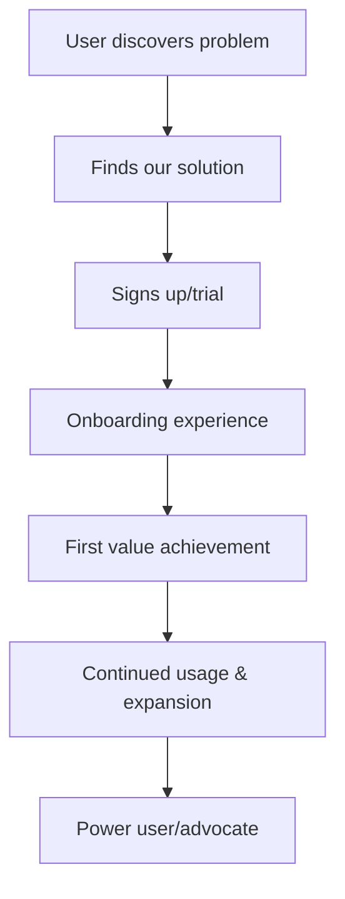

# Product Vision Template

## Vision Statement
**Product Name**: [Enter product name]
**Vision Statement**: [One sentence describing the product's ultimate purpose and impact]

*Example: "To become the leading platform that enables mid-market companies to automate their customer onboarding processes, reducing time-to-value by 50% while improving customer satisfaction."*

## Product Overview
### What We're Building
[2-3 paragraphs describing what the product is, what it does, and why it exists]

### Who It's For
**Primary Target Audience**: [Specific user persona or market segment]
**Secondary Audiences**: [Additional user groups or stakeholders]

### Core Problem We Solve
**Problem Statement**: [Clear description of the main problem your product addresses]
**Market Size**: [Total addressable market and opportunity size]
**Current Solutions**: [How customers solve this problem today and their limitations]

## Value Proposition
### Unique Value Proposition
[One clear sentence describing the unique value your product delivers]

### Key Benefits
1. **[Benefit 1]**: [Description and quantified impact]
2. **[Benefit 2]**: [Description and quantified impact]  
3. **[Benefit 3]**: [Description and quantified impact]

### Competitive Differentiation
- **[Differentiator 1]**: [How we're different and why it matters]
- **[Differentiator 2]**: [How we're different and why it matters]
- **[Differentiator 3]**: [How we're different and why it matters]

## Product Strategy
### Strategic Objectives
#### Year 1 Objectives
- [Objective 1 with success criteria]
- [Objective 2 with success criteria]
- [Objective 3 with success criteria]

#### Year 2-3 Objectives  
- [Longer-term objective 1]
- [Longer-term objective 2]
- [Longer-term objective 3]

### Success Metrics
#### Business Metrics
- **Revenue**: [Target revenue or growth rate]
- **Market Share**: [Market penetration goals]
- **Customer Acquisition**: [Customer growth targets]
- **Customer Retention**: [Retention rate targets]

#### Product Metrics
- **User Adoption**: [Usage and engagement targets]
- **Feature Utilization**: [Key feature adoption rates]
- **Performance**: [Speed, reliability, uptime targets]
- **Quality**: [Defect rates, customer satisfaction scores]

## Target Market Analysis
### Primary Market Segment
**Segment Description**: [Detailed description of primary target market]
**Market Size**: [Size and growth potential]
**Key Characteristics**: [Demographics, technographics, behavioral traits]
**Pain Points**: [Specific problems this segment faces]
**Buying Process**: [How they evaluate and purchase solutions]

### Secondary Market Segments
**Segment 2**: [Description, size, characteristics]
**Segment 3**: [Description, size, characteristics]

### Market Trends
- **[Trend 1]**: [Description and impact on product strategy]
- **[Trend 2]**: [Description and impact on product strategy]
- **[Trend 3]**: [Description and impact on product strategy]

## Competitive Landscape
### Direct Competitors
**[Competitor 1]**: 
- Strengths: [What they do well]
- Weaknesses: [Their limitations]
- Market Position: [Their market share and positioning]

**[Competitor 2]**:
- Strengths: [What they do well]
- Weaknesses: [Their limitations]  
- Market Position: [Their market share and positioning]

### Indirect Competitors
- **[Alternative Solution 1]**: [How customers might solve the problem differently]
- **[Alternative Solution 2]**: [Another alternative approach]

### Competitive Strategy
- **Win Against [Competitor 1]**: [Key competitive strategy]
- **Win Against [Competitor 2]**: [Key competitive strategy]
- **Defend Against New Entrants**: [Defensive strategies]

## Product Roadmap Overview
### Release 1.0 ([Timeline])
**Core Features**:
- [Feature 1]: [Description and user value]
- [Feature 2]: [Description and user value]
- [Feature 3]: [Description and user value]

**Success Criteria**: [How we'll measure success of initial release]

### Release 2.0 ([Timeline])
**Enhanced Features**:
- [Feature 4]: [Description and user value]
- [Feature 5]: [Description and user value]
- [Feature 6]: [Description and user value]

**Success Criteria**: [Success metrics for second release]

### Future Vision (Year 2-3)
**Advanced Capabilities**:
- [Advanced Feature 1]: [Vision for future capability]
- [Advanced Feature 2]: [Vision for future capability]
- [Platform Evolution]: [How the product will evolve]

## User Experience Vision
### User Journey

### Key User Personas
#### Primary Persona: [Persona Name]
- **Role**: [Job title and function]
- **Goals**: [What they want to achieve]
- **Pain Points**: [Current challenges]
- **How Our Product Helps**: [Specific value delivery]

#### Secondary Persona: [Persona Name]
- **Role**: [Job title and function]
- **Goals**: [What they want to achieve]
- **Pain Points**: [Current challenges]
- **How Our Product Helps**: [Specific value delivery]

### User Experience Principles
1. **[Principle 1]**: [Description of UX principle]
2. **[Principle 2]**: [Description of UX principle]
3. **[Principle 3]**: [Description of UX principle]

## Technology Vision
### Architecture Principles
- **[Principle 1]**: [Technical architecture principle and rationale]
- **[Principle 2]**: [Technical architecture principle and rationale]
- **[Principle 3]**: [Technical architecture principle and rationale]

### Technology Stack
**Frontend**: [Technology choices and rationale]
**Backend**: [Technology choices and rationale]  
**Database**: [Technology choices and rationale]
**Infrastructure**: [Cloud/hosting strategy]
**Integration**: [API and integration strategy]

### Scalability & Performance
- **Performance Targets**: [Response time, throughput requirements]
- **Scalability Plans**: [How we'll handle growth]
- **Reliability Goals**: [Uptime and availability targets]

## Go-to-Market Strategy
### Launch Strategy
**Launch Timeline**: [When and how we'll launch]
**Launch Channels**: [How we'll reach initial customers]
**Launch Metrics**: [How we'll measure launch success]

### Pricing Strategy
**Pricing Model**: [How we'll price the product]
**Price Points**: [Specific pricing tiers or amounts]
**Value Justification**: [Why customers will pay this price]

### Sales & Marketing Approach
- **Sales Strategy**: [How we'll sell the product]
- **Marketing Channels**: [How we'll generate demand]
- **Partnership Strategy**: [Channel partners or integrations]

## Resource Requirements
### Team Structure
**Product Team**: [Product managers, designers, researchers needed]
**Engineering Team**: [Developers, architects, DevOps needed]
**Go-to-Market Team**: [Sales, marketing, customer success needs]
**Support Functions**: [Legal, finance, operations support]

### Investment Requirements
**Development Investment**: [R&D costs and timeline]
**Go-to-Market Investment**: [Sales and marketing budget]
**Infrastructure Investment**: [Technology and operational costs]
**Total Investment**: [Overall budget requirements]

## Risk Assessment
### Product Risks
- **[Technical Risk]**: [Description, likelihood, impact, mitigation]
- **[Market Risk]**: [Description, likelihood, impact, mitigation]
- **[Competitive Risk]**: [Description, likelihood, impact, mitigation]

### Business Risks
- **[Financial Risk]**: [Description and mitigation strategy]
- **[Execution Risk]**: [Description and mitigation strategy]
- **[Strategic Risk]**: [Description and mitigation strategy]

## Success Criteria & KPIs
### Product Success Metrics
- **User Adoption**: [Specific targets and timelines]
- **User Engagement**: [Usage frequency and depth metrics]
- **Feature Adoption**: [Key feature utilization rates]
- **User Satisfaction**: [NPS, CSAT, retention metrics]

### Business Success Metrics
- **Revenue Growth**: [Revenue targets and milestones]
- **Customer Acquisition**: [New customer targets]
- **Market Penetration**: [Market share goals]
- **Profitability**: [Path to profitability timeline]

## Governance & Decision Making
### Key Stakeholders
- **Product Owner**: [Name and decision authority]
- **Executive Sponsor**: [Name and oversight role]
- **Engineering Lead**: [Name and technical authority]
- **Go-to-Market Lead**: [Name and commercial authority]

### Decision Framework
- **Product Decisions**: [Who decides on product features and priorities]
- **Technical Decisions**: [Who decides on architecture and technology]
- **Business Decisions**: [Who decides on pricing, positioning, partnerships]

### Review Processes
- **Weekly Reviews**: [What gets reviewed and by whom]
- **Monthly Reviews**: [Business metrics and progress assessment]
- **Quarterly Reviews**: [Strategic review and planning updates]

---

## Usage Instructions
1. **Complete all sections** with specific, measurable details
2. **Validate with stakeholders** to ensure alignment
3. **Update regularly** as market conditions and strategy evolve
4. **Use as a reference** for all product decisions and trade-offs
5. **Share broadly** to ensure team alignment and understanding
6. **Link to detailed requirements** and specifications as they're developed