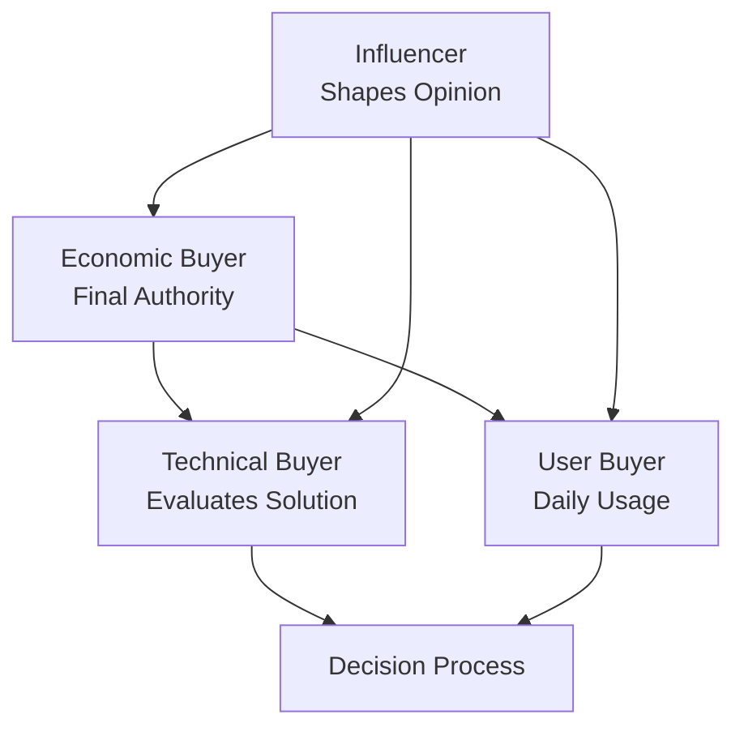

# Stakeholder Analysis Tool

## Tool Purpose
Identify, categorize, and analyze key stakeholders in the customer organization to understand decision-making dynamics, influence patterns, and engagement strategies.

## Input Format
**Source Material**: [Meeting notes, org charts, conversation transcripts]
**Analysis Scope**: [Decision-making unit, broader organization, or specific department]
**Project Context**: [Type of project, decision complexity, timeline]

## Output Structure

### Stakeholder Mapping
**Format**: [STAKE-001] [Name/Role] - [Stakeholder Type]

#### Primary Stakeholders (Direct involvement/impact)
**[STAKE-001] [Name], [Title]** - [Decision Maker/Influencer/User/Champion]
- **Department/Function**: [Organizational unit]
- **Decision Authority**: [High/Medium/Low] - [Specific authority scope]
- **Influence Level**: [High/Medium/Low] - [Sphere of influence]
- **Interest Level**: [High/Medium/Low] - [Engagement with project]
- **Support Level**: [Strong Support/Support/Neutral/Concern/Opposition]
- **Key Concerns**: [Primary interests and worries]
- **Success Criteria**: [What success looks like to them]
- **Communication Style**: [Preferred interaction approach]
- **Source**: [Where information came from]

#### Secondary Stakeholders (Indirect involvement/impact)
**[STAKE-005] [Name], [Title]** - [Affected Party/Reviewer/Approver]
- **Relationship to Project**: [How they're connected]
- **Potential Impact**: [How project affects them]
- **Influence Method**: [How they influence decisions]
- **Engagement Need**: [Level of involvement required]

### Decision-Making Analysis

#### Decision-Making Unit (DMU)


**Economic Buyer**: [Name, Title, Authority Level]
- **Budget Authority**: [Dollar limit and approval process]
- **Decision Timeline**: [When they typically make decisions]
- **Risk Tolerance**: [Conservative/Moderate/Aggressive]
- **Previous Decisions**: [Historical decision patterns]

**Technical Buyer**: [Name, Title, Evaluation Focus]
- **Technical Expertise**: [Areas of technical knowledge]
- **Evaluation Criteria**: [What they assess and prioritize]
- **Vendor Experience**: [Past vendor relationships and preferences]
- **Integration Concerns**: [Technical constraints and requirements]

**User Buyer**: [Name, Title, Usage Context]
- **Daily Usage**: [How they'll interact with solution]
- **Current Pain Points**: [Specific problems they face]
- **Success Metrics**: [How they measure improvement]
- **Change Readiness**: [Openness to new processes/tools]

### Influence Map
**High Influence Stakeholders**:
- **[Name]**: [Why they have high influence and how they use it]
- **[Name]**: [Why they have high influence and how they use it]

**Key Influence Relationships**:
- **[Name 1] → [Name 2]**: [Nature of influence relationship]
- **[Name 2] → [Name 3]**: [Nature of influence relationship]

**Influence Networks**:
- **Technical Network**: [Who influences technical decisions]
- **Business Network**: [Who influences business decisions]
- **Political Network**: [Who influences organizational dynamics]

### Stakeholder Concerns & Motivations

#### Concern Analysis
**Technical Concerns**:
- **Integration Complexity**: [Who is concerned and why]
- **System Performance**: [Performance expectations and worries]
- **Security/Compliance**: [Regulatory and security concerns]

**Business Concerns**:
- **ROI/Budget**: [Financial concerns and expectations]
- **Timeline/Disruption**: [Implementation and change concerns]
- **User Adoption**: [Concerns about team acceptance]

**Political Concerns**:
- **Organizational Impact**: [How this affects power/structure]
- **Career Impact**: [Individual career implications]
- **Competitive Dynamics**: [Internal competition for resources]

#### Motivation Analysis
**Positive Motivators** (What drives support):
- **Business Results**: [Outcomes that motivate stakeholders]
- **Personal Benefits**: [Individual gains from success]
- **Problem Resolution**: [Pain points the solution addresses]

**Negative Motivators** (What creates resistance):
- **Risk Factors**: [What stakeholders want to avoid]
- **Loss Concerns**: [What they might lose or give up]
- **Change Resistance**: [Comfort with status quo]

## Engagement Strategy

### Stakeholder Engagement Plan
**[STAKE-001] [Name] - [High Priority/Medium Priority/Low Priority]**
- **Engagement Frequency**: [How often to interact]
- **Communication Channels**: [Preferred contact methods]
- **Content Strategy**: [What information they need/want]
- **Influence Strategy**: [How to build support and address concerns]
- **Success Metrics**: [How to measure engagement effectiveness]

### Communication Matrix
| Stakeholder | Message Focus | Frequency | Channel | Owner |
|-------------|---------------|-----------|---------|-------|
| [Name, Role] | [Key messages] | [Weekly/Monthly] | [Email/Meeting/Demo] | [Team member] |
| [Name, Role] | [Key messages] | [Weekly/Monthly] | [Email/Meeting/Demo] | [Team member] |

### Objection Handling Strategy
**Common Objections Expected**:
1. **"Too expensive"** → [Counter-strategy and supporting evidence]
2. **"Too risky"** → [Risk mitigation approach and proof points]
3. **"Not the right time"** → [Urgency creation and timing rationale]
4. **"Current solution works"** → [Status quo cost and improvement opportunity]

## Analysis Guidelines

### Information Gathering Techniques
1. **Direct Observation**: [Notes from meetings and interactions]
2. **Organizational Research**: [Public information and LinkedIn profiles]
3. **Reference Conversations**: [Insights from similar customer situations]
4. **Internal Intelligence**: [Team knowledge and CRM data]

### Stakeholder Assessment Criteria
**Decision Authority Indicators**:
- Budget sign-off authority
- Project approval power
- Veto capability
- Historical decision patterns

**Influence Indicators**:
- Organizational position and reporting relationships
- Expertise and credibility in relevant areas
- Network connections and relationships
- Communication patterns and frequency

**Support Level Indicators**:
- Verbal and non-verbal communication cues
- Questions asked and concerns raised
- Proactive engagement and follow-up
- Reference to benefits and positive outcomes

### Risk Assessment
**High Risk Stakeholders**: [Those who could derail the project]
- **[Name]**: [Why they're high risk and mitigation strategy]

**Medium Risk Stakeholders**: [Those who need careful management]
- **[Name]**: [Potential issues and management approach]

**Supportive Stakeholders**: [Those who advocate for the project]
- **[Name]**: [How to leverage their support]

## Usage Instructions

### Step 1: Stakeholder Identification
1. **Review all source materials** for mentions of people and roles
2. **Map organizational structure** from available information
3. **Identify decision makers** with budget and approval authority
4. **Note users and implementers** who will work with the solution
5. **Find influencers** who shape opinions and decisions

### Step 2: Stakeholder Analysis
1. **Assess decision authority** for each stakeholder
2. **Evaluate influence levels** and influence relationships
3. **Determine interest and support levels** for the project
4. **Identify concerns and motivations** for each person
5. **Map communication and engagement preferences**

### Step 3: Strategy Development
1. **Create engagement strategies** for each key stakeholder
2. **Plan communication approaches** and messaging
3. **Develop objection handling** for anticipated concerns
4. **Identify coalition building** opportunities
5. **Plan risk mitigation** for unsupportive stakeholders

### Step 4: Validation and Updates
1. **Test assumptions** through continued interactions
2. **Update analysis** as new information emerges
3. **Track engagement effectiveness** and adjust strategies
4. **Monitor stakeholder dynamics** and relationship changes

## Quality Checklist

Before finalizing stakeholder analysis:
- [ ] All key roles in decision process identified
- [ ] Decision authority levels clearly understood
- [ ] Influence relationships mapped accurately
- [ ] Concerns and motivations documented for each stakeholder
- [ ] Engagement strategies defined for high-priority stakeholders
- [ ] Communication preferences noted
- [ ] Risk factors identified and mitigation planned
- [ ] Supporting evidence linked to source materials
- [ ] Coalition building opportunities identified
- [ ] Success criteria defined for stakeholder engagement

## Output Example

```markdown
## Stakeholder Analysis Summary
**Total Stakeholders Identified**: 8
**High Influence**: 3 stakeholders
**Decision Makers**: 2 stakeholders
**High Risk**: 1 stakeholder

### Decision Making Unit
**Economic Buyer**: Sarah Johnson, VP Finance (High authority, budget owner)
**Technical Buyer**: Mike Chen, IT Director (Solution evaluation lead)  
**User Buyer**: Lisa Rodriguez, Operations Manager (Daily user, change champion)

### Engagement Priorities
**Tier 1 (Weekly engagement)**: Sarah Johnson, Mike Chen
**Tier 2 (Bi-weekly engagement)**: Lisa Rodriguez, David Park
**Tier 3 (Monthly updates)**: Remaining stakeholders

### Key Risks & Mitigation
**High Risk**: David Park (CTO) - Prefers build over buy
**Mitigation Strategy**: Technical deep-dive session, reference customer calls
```

This tool ensures comprehensive stakeholder understanding for effective sales strategy and project success.